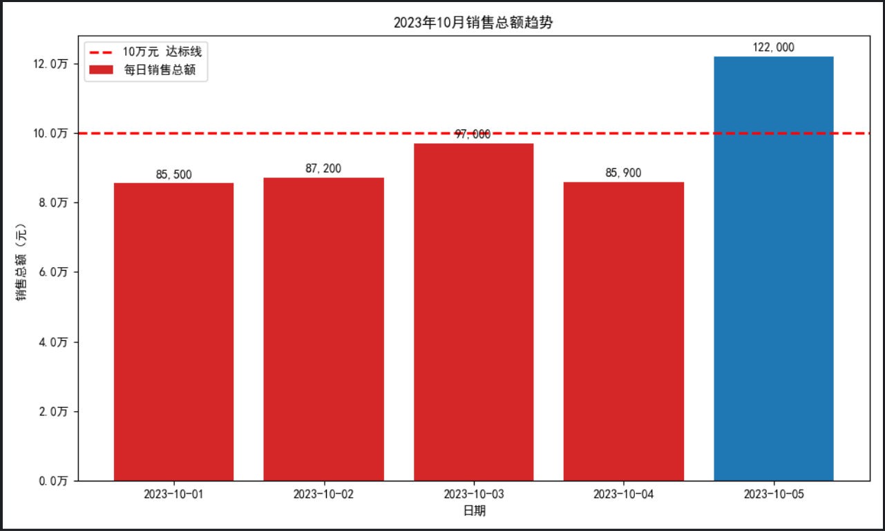

# 智能数据库问答 Agent (Text-to-SQL Agent)

一个基于 **LangGraph** 构建的自然语言数据库问答智能体：用户用中文提问，Agent 自动完成「检索相关表结构 → 生成 SQL → 执行查询 → 出错自动修复 → 结果解读 → 智能可视化」的全流程，让不懂 SQL 的业务人员也能自助查询数据库。

> 本项目为个人学习项目，从 v1 到 v4 逐步迭代实现，完整提交记录见 commit 历史。

---

## ✨ 核心功能

| 功能 | 说明 |
|------|------|
| 🔍 **RAG 表结构检索** | 将每张表的结构向量化存入 ChromaDB，提问时只检索**最相关的表**喂给大模型，避免 Schema 过长干扰、提升 SQL 准确率 |
| 🧠 **思维链生成 SQL** | 引导大模型先分析（用到哪些表、字段、JOIN 条件）再生成 SQL，并通过 Pydantic 约束为结构化输出 |
| 🔁 **SQL 报错自动修复** | 基于 LangGraph 条件边构建重试闭环：SQL 执行报错时，Agent 自动读取错误信息并重新生成，最多重试 3 次 |
| 📊 **查询结果智能可视化** | 当问题涉及「趋势 / 占比 / 分布 / 对比」等场景时，Agent 自动生成 Matplotlib 代码并绘制图表 |
| 💬 **自然语言解读** | 将查询结果翻译成通俗易懂的自然语言回答 |

---

## 🏗️ 架构流程

```
用户提问
   │
   ▼
[schema]  ──→ RAG 检索最相关的表结构 (ChromaDB)
   │
   ▼
[generate_sql] ──→ 思维链分析 + 生成 SQL (Pydantic 结构化输出)
   │
   ▼
[run_sql] ──→ 执行 SQL
   │
   ├── 出错 & 重试<3 ──→ 回到 [generate_sql] (带着报错信息重写)
   │
   ▼ 成功
[chart] ──→ 判断是否需要可视化，需要则生成图表
   │
   ▼
[explain] ──→ 自然语言解读结果
   │
   ▼
 输出答案
```

---

## 🛠️ 技术栈

- **Agent 编排**：LangGraph (StateGraph / 条件边 / 状态管理)
- **大模型应用**：LangChain、DeepSeek API
- **RAG / 向量库**：ChromaDB、HuggingFace Embeddings (`BAAI/bge-small-zh-v1.5`)
- **数据库**：MySQL、PyMySQL
- **数据处理与可视化**：Pandas、Matplotlib
- **结构化输出**：Pydantic

---

## 📁 项目结构

```
├── state.py     # AgentState 状态定义
├── db.py        # 数据库连接、Schema 提取、SQL 执行
├── rag.py       # RAG：表结构向量化建库 + 相似度检索 (ChromaDB)
├── nodes.py     # 各节点：生成SQL / 执行 / 解释 / 可视化
├── graph.py     # LangGraph 流程编排、条件边
├── main.py      # 程序入口
└── requirements.txt
```

---

## 🚀 快速开始

### 1. 安装依赖
```bash
pip install -r requirements.txt
```

### 2. 配置环境变量
在项目根目录新建 `.env` 文件（可参考 `.env.example`）：
```
DEEPSEEK_API_KEY=你的DeepSeek API Key
DB_HOST=localhost
DB_PORT=3306
DB_USER=你的数据库用户名
DB_PASSWORD=你的数据库密码
DB_NAME=你的数据库名
```

### 3. 构建向量库（首次运行，或表结构变化时执行一次）
```python
from rag import build_vectorstore
build_vectorstore()
```

### 4. 运行
```bash
python main.py
```

---

## 💡 示例

**提问：**
> 帮我统计 2023 年 10 月份这 5 天每天的整体销售总额，判断是否达到 10 万元及格线，并画一张柱状图展示趋势，标注 10 万元红色基准线。

**Agent 自动完成：** 检索相关表 → 生成多表关联 SQL → 执行 → 生成柱状图（含基准线）→ 文字解读。



---

## 📌 说明

- 本项目用于学习 LangChain / LangGraph 的 Agent 开发，重点实践了 RAG、条件边自修复、结构化输出等核心技术。
- `rag.py` 中 `PERSIST_DIR` 目前为本地绝对路径，clone 后请按需修改为相对路径或自己的路径。
